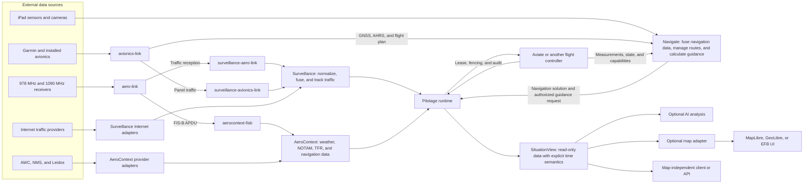

# ADR-0035: Source-neutral situational services and Pilotage composition

- Status: Accepted
- Date: 2026-08-08

## Context

Pilotage can run on a small companion computer. It can also run on iPadOS with
an EFB client. Each installation can use a different set of data sources.

A source can be a local radio, installed avionics, an Internet provider, a
sensor, a camera, or a flight controller. These sources do not have the same
delay, quality, or failure modes. The system must keep the source information
and the time information.

Traffic data and aeronautical context have different state rules. Traffic data
needs fast updates, fusion, coasting, and removal. Weather, NOTAM, TFR, and
navigation data need product assembly, revision, validity, and expiry.

A map is one data consumer. AI is another data consumer. Neither consumer is a
required part of a headless installation.

This record defines the owner of each state. It also defines the allowed
dependency direction. A source-neutral model uses the same domain types for all
sources.

This record replaces the advisory-data ownership in proposed ADR-0023 and
proposed ADR-0030. Those records must use the AeroContext and Surveillance
names before acceptance.

## Decision

### Ownership

| Component | Owns | Does not own |
|---|---|---|
| `aero-link` | Radio access, demodulation, framing, correction, stateless protocol decode, and `ReceptionEvent` | Traffic tracks, weather-product state, maps, or application routing |
| `avionics-link` | Installed-avionics transport, protocol decode, and thin source adapters | A second traffic, weather, or navigation state engine |
| Surveillance | Source-neutral traffic observations, identity, fusion, freshness, tracks, deltas, and snapshots | Radio access, weather products, maps, or Pilotage authority |
| AeroContext | Weather, NOTAM, TFR, briefing, navigation-data snapshots, source comparison, revision, validity, and expiry | Traffic tracks, ownship navigation, flight control, or maps |
| Navigate | Ownship navigation fusion, integrity, route execution, guidance, terrain functions, and navigation functions that use cameras or celestial data | Flight-control actuation, traffic tracks, weather-product state, or maps |
| Aviate or another flight controller | Control-grade estimation, stabilization, command results, and actuation | EFB state or advisory product state |
| Pilotage | Composition, capability profiles, sessions, authority, leases, fencing, audit, supervision, and read-only situation queries | A replacement mutable state engine for another domain |
| Indicate | Instrument state contracts, panel sets, scene contracts, registry, and admission tests | Pilotage sessions, maps, or platform UI policy |

`Communicate` is not a general data domain. Add a shared communication
mechanism to it only when two components need the same transport, job, or
store-and-forward behavior.

### Dependency direction

An adapter can depend on a source contract and a domain contract. A domain core
must not depend on a source adapter.

### Data and time rules

- Attach the local monotonic receive time at the first software boundary.
- Keep the source identity, origin, delivery path, and time quality.
- Do not compare a raw provider clock with a local monotonic clock.
- Map a trusted provider time into the local time domain in the source adapter.
- Keep unknown or untrusted source time explicit.
- Keep raw or decoded source data available for replay and diagnosis.
- Do not make a display object the only copy of domain state.

Surveillance emits `TrackDelta` and `TrackSnapshot` values. AeroContext emits
product events and immutable snapshots. Navigate emits a navigation solution,
integrity state, and guidance requests. Pilotage joins read-only handles to
these values in `SituationView`.

`SituationView` uses an explicit query time. It does not own the mutable state
that it reads. It keeps enough source and age data to explain a result.

AI and map adapters can read `SituationView`. They cannot bypass Pilotage
authority. Only the Pilotage lease, fencing, and audit path can send an
authorized command to the flight controller.

### Queue rules

Each data class has a separate bounded queue or bounded store.

- For traffic display updates, the latest valid state can replace an older
  pending state.
- For FIS-B product fragments, the product store keeps the fragments that it
  needs for assembly.
- For map updates, the display can drop or combine obsolete updates.
- For raw recording, an independent bounded path prevents disk work from
  stopping reception.

An output consumer must not stop a receiver or a control path.

### Deployment rules

A companion-computer build can run without MapLibre, GeoLibre, Swift, a
browser, or AI. It links only the domain cores and adapters that its capability
profile needs.

An iPadOS build can link the same portable cores in the application process. It
can use local sensors, installed avionics, Internet providers, or direct radio
adapters. A process boundary is a deployment choice. It is not a package
boundary.

A high-rate local path can use DMA or shared memory. The path must still keep
source identity, clock correspondence, calibration, health, and result
contracts. Advisory data must not become a control-grade measurement without a
declared navigation adapter and integrity policy.

## Consequences

- A new radio or provider adds an adapter. It does not change a domain core.
- Local radio traffic, panel traffic, Internet traffic, replay, and simulation
  use one Surveillance model.
- FIS-B and Internet context use one AeroContext model.
- A headless system can supply situation data to an API or to AI without a map.
- A map can fail or restart without loss of domain state.
- Each component can have its own test corpus, replay tool, resource limits,
  and assurance evidence.
- The first deployment can use one process. A later deployment can separate
  processes without a change to domain ownership.

## Alternatives considered

- **One global mutable world model:** Rejected. It hides the owner of state and
  makes independent tests and assurance difficult.
- **A source-specific domain core:** Rejected. A new source would change the
  domain model and its consumers.
- **A map-specific canonical model:** Rejected. A headless installation and a
  non-map consumer must use the same domain data.
- **One process for each protocol message type:** Rejected. Package boundaries
  and process boundaries solve different problems.
