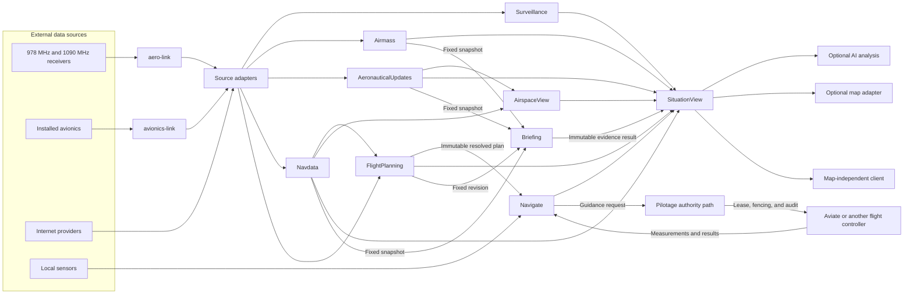

# ADR-0036: Separate situational state by lifecycle

- Status: Accepted
- Date: 2026-08-09
- Supersedes on acceptance: [ADR-0035](0035-source-neutral-situational-services.md)

## Context

[ADR-0035](0035-source-neutral-situational-services.md) defines source-neutral
services. It defines the dependency direction and the time rules for these
services. It also assigns weather, notices, navigation data, and briefing data
to one `AeroContext` state owner.

These data categories have different lifecycle rules.

- Weather data has an issue time, a valid period, revisions, and expiry.
- Aeronautical updates amend or qualify baseline aeronautical information.
- Navigation data has a cycle-dated baseline.
- FlightPlanning has draft and resolved plan revisions. It also has filing
  state. Navigate activates one immutable resolved revision.
- A briefing is an immutable result for one plan and one requested time.

One mutable state owner couples these rules. It also makes independent tests,
resource limits, and deployment choices difficult.

Flight Information Services-Broadcast (FIS-B) is an aviation broadcast data
service. It can carry weather, notices, and service-status data.

This record changes domain ownership. It keeps the source-neutral dependency
rules, time rules, and deployment rules from ADR-0035. It does not select a
repository boundary or a process boundary. It does not define a FIS-B exchange
schema, an executor, or a channel policy.

## Decision

### Contract terms

A source epoch identifies one continuous source instance. It changes after a
source restart or a loss of sequence continuity.

A producer instance ID identifies one continuous instance that creates domain
snapshots. A snapshot revision orders published states for one snapshot subject
from that producer instance. A consumer compares revisions only when the
producer instance ID and subject identity are equal.

Navdata is the component that owns the complete navigation baseline. It uses
the [common snapshot envelope](../domain-snapshot-envelope.md). Its snapshot
subject is the complete navigation baseline selection. This subject identity
stays constant when the selected cycle or built snapshot changes.

The Navdata domain snapshot contains a navigation-data cycle, a snapshot ID,
and a snapshot digest. These three values are the Navdata snapshot identity.
The cycle identifies the published effective edition. The snapshot ID
identifies one immutable built snapshot. The snapshot digest verifies the
canonical snapshot content and its cycle.

The producer instance ID and snapshot revision identify publications of the
Navdata subject. They do not replace the Navdata snapshot identity. A Navdata
producer increments the revision when it publishes a different snapshot ID or
changes another published member. The cycle is not the revision. A producer
restart can publish the same cycle, snapshot ID, and snapshot digest under a
new producer instance ID. Revisions from the two producer instances have no
order.

Equal Navdata snapshot IDs must have equal cycles and snapshot digests. A build
that changes the canonical content must use a new snapshot ID and snapshot
digest. A consumer uses the Navdata snapshot identity after a producer restart.
It uses the producer instance ID, subject identity, and revision for continuity
and gap detection.

A snapshot handle is an immutable reference to one domain snapshot.

A valid time states when data is in effect. It selects a restriction validity
window or the navigation-data cycle that is effective at that time.

A knowledge time states when the system held data. It selects a snapshot
handle from a retained handle ring or a replay of the ingress stream.

A time query fixes one of these axes. The query and its result state the axis
and its value. They must not use one value as both valid time and knowledge
time.

A clock correspondence maps values between two clocks. It states the mapping
uncertainty and the interval in which the mapping is valid.

A coherence requirement states which mix of snapshot times or revisions a
query can accept.

Best-available consistency captures the current snapshot handle from each
selected domain. It does not use a transaction across domains.

Lossy replication is a transfer that can omit an update. A base revision
identifies the state to which an update applies. Snapshot recovery replaces
local replicated state after a revision gap.

An idempotency ID identifies one external effect across retries.

### State ownership

This record defines `AeronauticalUpdates` as the service for perishable
aeronautical changes and aeronautical operational status. This service
includes Notice to Air Missions (NOTAM), temporary flight restrictions
(TFRs), cancellations, and special-use airspace status. It does not include
the cycle-dated navigation baseline.

A domain ingress value is a source-neutral input to a domain core.

| Component | Owns | Does not own |
|---|---|---|
| `aero-link` | Radio access, framing, correction, protocol decode, bounded FIS-B product assembly, and protocol classification | Weather lifecycle, notice lifecycle, traffic tracks, or application consumer selection |
| `avionics-link` | Installed-avionics transport, protocol decode, and source adapters | A second traffic, weather, navigation, or plan state engine |
| Surveillance | Source-neutral traffic observations, identity, fusion, freshness, tracks, deltas, and snapshots | Radio access, weather, aeronautical updates, or maps |
| Airmass | Meteorological observations, forecasts, hazards, revisions, validity, expiry, and source comparison | Aeronautical updates, the navigation baseline, or maps |
| `AeronauticalUpdates` | Perishable notices, cancellations, restrictions, aeronautical operational status, validity, expiry, and source comparison | Weather, the navigation baseline, link health, or maps |
| Navdata | The cycle-dated National Airspace System Resources (NASR) and Coded Instrument Flight Procedures (CIFP) baseline for airports, runways, navaids, fixes, airspace volumes, airways, and procedures | Perishable weather or aeronautical updates |
| FlightPlanning | Plan drafts, navdata resolution, static and regulatory validation, filing state, and immutable plan revisions | Vehicle-specific activation checks, active-leg state, execution, or guidance |
| Briefing | A point-in-time composition and its immutable evidence result | Live domain state |
| Navigate | Ownship navigation, integrity, vehicle-specific activation checks, active-plan state, execution, and guidance | Draft editing, filing state, flight-control actuation, or advisory product state |
| Pilotage | Composition, capability profiles, sessions, authority, leases, fencing, audit, and read-only situation queries | A second authoritative mutable state engine for another domain |
| Aviate or another flight controller | Control-grade estimation, stabilization, command results, and actuation | Advisory product state |
| Indicate | Instrument state contracts, panel sets, scene contracts, registry, and admission tests | Pilotage sessions, maps, or platform user-interface policy |

`Communicate` is not a data domain. Put a mechanism in `Communicate` only when
two components need the same transport, job, or store-and-forward behavior.

`AeroContext` becomes a compatibility facade. It can adapt the domain
snapshots to an existing consumer interface. It must not keep a second
authoritative copy of domain state. Provider orchestration belongs in
composition adapters, not in the compatibility facade.

An application owns presentation, tiles, and styling. A tile bundle or a
GeoJSON document is an encoding at a renderer edge. It is not domain state. A
domain must not produce it.

An offline build converts one Navdata snapshot into a versioned tile bundle
for its cycle. The bundle carries the navigation-data cycle and snapshot
digest. The renderer caches this bundle. The build must not put a full NASR
extract in the renderer's live snapshot path. A perishable update stays a live
overlay feature.

A coherence requirement also applies to a rendered composition. A tile bundle
and an overlay stream each carry a navigation-data cycle. A rendered
composition that has two cycle identities is invalid. The client must reject
the composition and report the mismatch.

Briefing reads fixed input revisions. Its input identifies a plan revision, a
requested valid time, a weather snapshot handle, an aeronautical-update
snapshot handle, and a Navdata snapshot handle. The Navdata handle includes
the navigation-data cycle, snapshot ID, and snapshot digest. The fixed
revisions select the knowledge state. The requested valid time selects the data
that is in effect in that state. Briefing records both selections in its
immutable evidence result.

An `AirspaceView` is a derived query result. It combines the navigation
baseline with applicable aeronautical updates and special-use airspace status.
It is not an authoritative store. An update can apply to a runway, a navaid, a
procedure, a service, or another subject with no horizontal geometry. The
update model must make geometry optional.

A required record named *AirspaceView resolution contract: subject to baseline
geometry* in [issue #349](https://github.com/luofang34/Pilotage/issues/349)
defines the resolution owner, cycle scope, result identity, and typed failure
reasons. It also defines how a result keeps an update that has no geometry.

### Dependency direction

A source adapter can depend on a source contract and a domain ingress
contract. A domain core must not depend on a source adapter or a source
protocol type.

Briefing reads only the fixed inputs in the diagram. `SituationView` can expose
the completed Briefing result as evidence. This edge does not make the result
live domain state.

For example, an Airmass adapter can consume an assembled FIS-B product and
produce a domain-owned weather ingress value. The Airmass core consumes the
weather ingress value. It does not consume `CompleteFisBProduct`.

Composition owns the mapping from a protocol category to installed consumers.
`aero-link` identifies protocol content. It does not identify an application
owner. A recorder is an observer and is not the only destination for unknown
content.

A protocol classification uses data-category names such as weather,
aeronautical update, link health, and unclassified. It does not use
application-owner names.

A FIS-B product that has one data category can use product-level
classification. A FIS-B Product 8 file carries notices and product-unavailable
reports. One file can contain records for more than one consumer. The Product
8 decoder must emit a classified protocol record for each record. Source
adapters convert these records into domain ingress values.

Availability data and current-report-list data can affect link health and
domain freshness. Composition can send one decoded record to both consumers.
Link health is ownerless derived evidence. Each consumer calculates it from
the records that it receives. No component stores link health as authoritative
state. A domain can use link health as quality evidence.

The FIS-B assembly output must preserve a bounded provenance summary. The
summary contains a bounded set of contributors and an overflow indicator. Each
contributor keeps the source identity and epoch, origin, delivery path, first
and last local monotonic receive times, station identity, source-time quality,
and time uncertainty.

The assembly API accepts a provenance context that `aero-link-core` owns. A
radio adapter maps receiver-specific data into this context. The core must not
depend on an `aero-link-rx` type.

The assembler must bound incomplete items, retained bytes, completed-product
size, and peak working memory. Each memory-growth operation must be fallible.
Allocation failure must produce an explicit result.

A required record named *FIS-B assembly and classification contract* defines
the exchange schema, record classification, storage bounds, and failure
behavior.

### Time model

Domain contracts use two clock domains.

- Civil UTC defines issue, effective, and valid periods.
- A runtime monotonic clock defines receive order, queue age, timeout, and
  replay order.

Attach the local monotonic receive time at the first software boundary. Keep
the source identity, source epoch, origin, delivery path, observation or
product time, and time quality. Keep time uncertainty when the source supplies
it.

Do not compare a raw source clock with a local monotonic clock. A source
adapter can map a trusted source time into the local time domain. If data
crosses a process boundary, carry a clock correspondence with its uncertainty
and valid interval. If no valid correspondence exists, report an age that
needs that correspondence as unknown.

Keep raw or decoded source data available for replay and diagnosis. Do not
make a display object the only copy of domain state.

### Situation view

`SituationView` is a read-only composition interface. It does not collect,
decode, or own authoritative domain state. It can keep a non-authoritative
cache of immutable snapshot handles.

A query supplies one query axis and one query UTC value. A valid-time query
uses that value to select the data that is in effect. It uses supplied snapshot
handles or captures the best available handles. A knowledge-time query uses
that value to select handles from a retained handle ring or a replay. It does
not use the value to select data by validity.

The composition host treats the query UTC value as the evaluation UTC value.
It attaches its local monotonic evaluation stamp and clock identity. A snapshot
from a different monotonic clock supplies a correspondence to the host clock.
Compatible monotonic stamps determine ingress age. The query can also supply
freshness and coherence requirements. The result repeats the query axis and
value.

A result supplies the producer instance ID and snapshot revision for each
domain snapshot. It also supplies per-field or per-contributor provenance when
sources differ. Provenance includes the source identity, source epoch, local
monotonic ingress time, source observation or product time, time quality, time
uncertainty, validity, and data quality. The result gives a reason for each
missing value.

A result that includes Navdata also supplies its navigation-data cycle,
snapshot ID, and snapshot digest. These fields are the Navdata snapshot
identity. The producer instance ID and revision identify its publication
stream.

Ingress age is the difference between the host evaluation stamp and the
translated monotonic ingress stamp. Stamps from the same clock need no clock
correspondence. Observation age is the difference between evaluation UTC and
a trusted source observation time. Report each age separately. Report an age
as unknown when its required time evidence is not valid.

A valid-time query that does not supply fixed handles uses best-available
consistency. It captures one immutable snapshot handle from each selected
domain before it evaluates the query. It does not promise an atomic update
across domains. The result identifies the producer instance ID and snapshot
revision from each domain. A consumer can use this information to explain the
composition.

A knowledge-time query must use a retained handle ring or a replay. It must not
fall back to current best-available handles. The result gives an absence reason
when the selected knowledge state is not available.

A lossy replication boundary needs a producer instance ID, a base revision, a
new revision, gap detection, and snapshot recovery. A separate transport
record defines these fields when a snapshot or delta stream crosses such a
boundary.

### Flight-plan handoff

FlightPlanning gives Navigate an immutable resolved plan revision. The handoff
includes the revision ID, schema version, content digest, navigation-data
cycle, snapshot ID, snapshot digest, units, datum, and validation evidence. A
draft change cannot change the active revision.

Navigate repeats the structural handoff checks. It also checks vehicle
capability, active configuration, and execution state. Navigate can reject
activation even when FlightPlanning accepted its checks.

An installed-avionics plan adapter converts source types into the
FlightPlanning contract. A source plan type must not become the canonical plan
type.

A filing request has an idempotency ID and the digest of the immutable plan
revision. Pilotage authorizes each external filing effect and records the
request and result. An adapter must reconcile an ambiguous timeout with the
provider before it sends a non-idempotent retry.

### Authority and deployment safety

AI, map, and other advisory adapters can read `SituationView`. They cannot
bypass Pilotage authority. Only the Pilotage lease, fencing, and audit path can
send an authorized command to a flight controller.

A high-rate local path can use direct memory access or shared memory. The path
must keep source identity, clock correspondence, calibration, health, and
result contracts.

Advisory data must not become a control-grade measurement without a declared
Navigate adapter and an integrity policy. A companion-computer deployment can
run without a map, a platform user interface, a browser, or AI. It links only
the cores and adapters that its capability profile needs.

An iPadOS application can link the same portable cores in its process. It can
use local sensors, installed avionics, Internet providers, or direct radio
adapters. A process boundary is a deployment choice. It is not a package
boundary.

### Portable cores and composition

A domain core is synchronous and has one writer. It receives time as input. It
returns its next required deadline to the host. It must not read a clock or
start a runtime timer.

A portable domain core uses `no_std + alloc`. A firmware profile that does not
permit dynamic allocation needs a tested fixed-capacity contract. Standard
library and asynchronous provider code stays in adapters.

An adapter or a composition host can use asynchronous I/O. A package boundary
does not require an asynchronous task or a process boundary.

Each deployed edge uses bounded storage. A slow consumer must not stop a
receiver or a control path. One domain output must not block an unrelated
domain output. Raw recording uses an independent bounded path.

A required record named *Component-edge delivery and supervision* defines
channel capacity, overflow behavior, loss ownership, counters, recovery, and
supervision for each deployed edge.

The repository owner and the release owner must approve and record a license
decision before the project links, distributes, or deploys a sibling component
or provider implementation. The decision must cover linking, distribution,
deployment form, source obligations, and data terms. An external interface is
permitted only when the recorded decision permits it. The project must replace
an implementation when no permitted use exists.

This record does not create a repository. Keep an existing package in its
present repository while its contract changes. A repository split needs a
versioned schema, a shared conformance corpus, an independent release need, a
recorded license decision, and an identified operational owner.

## Migration order

1. Define the domain-owned ingress contracts. The immutable snapshot part is
   complete in the [domain snapshot envelope contract](../domain-snapshot-envelope.md).
2. Define the `SituationView` request and result contract. Add a conformance
   corpus with test inputs and required results.
3. Record the required license decisions for each sibling component that the
   compatibility implementation will use.
4. Implement `SituationView` as an adapter over `AeroContext`.
5. Move only consumers of the joint `AeroContext` query to `SituationView`.
   Briefing and single-domain consumers continue to use domain contracts.
6. Move network provider traits from the portable core to adapter contracts.
   Send the same immutable ingress values to the compatibility path and the
   new domain stores.
7. Run the new domain stores in parallel with the compatibility path. Compare
   their outputs.
8. Convert installed-avionics plan input through a FlightPlanning adapter.
9. Switch one `SituationView` backend at a time after comparison succeeds.
10. Select repository and process boundaries only after the schema, corpus,
    release need, license decision, and operational owner are stable.
11. Remove the compatibility facade after the last joint-query consumer
    moves.

## Consequences

- A source adds an adapter. It does not change a domain core.
- Each state owner has one lifecycle and one authoritative writer.
- A headless deployment can link only the required cores and adapters.
- A repository split is possible, but this record does not require it.
- FIS-B assembly stays in the link service without making a domain core depend
  on a link type.
- `SituationView` can report mixed-age data without claiming false atomicity.
- The FIS-B contract and the execution policy get independent review and can
  change independently.

## Alternatives considered

- **Keep one `AeroContext` state owner.** Rejected. The data categories have
  different lifecycle and validation rules.
- **Make domain cores consume `CompleteFisBProduct`.** Rejected. This creates a
  source dependency in each domain core.
- **Make one Airspace store own all notices.** Rejected. Many notices do not
  describe airspace. `AirspaceView` is a derived result.
- **Make FlightPlanning own activation validation.** Rejected. Navigate must
  validate the active vehicle and configuration.
- **Require an atomic `SituationView` result.** Rejected for the first
  contract. The added coordination is not necessary for a best-available
  advisory view.
- **Select repository topology in this record.** Rejected. A repository is a
  governance boundary, not a state lifecycle.
- **Include FIS-B schema and channel policy in this record.** Rejected. These
  choices can change independently from domain ownership.
