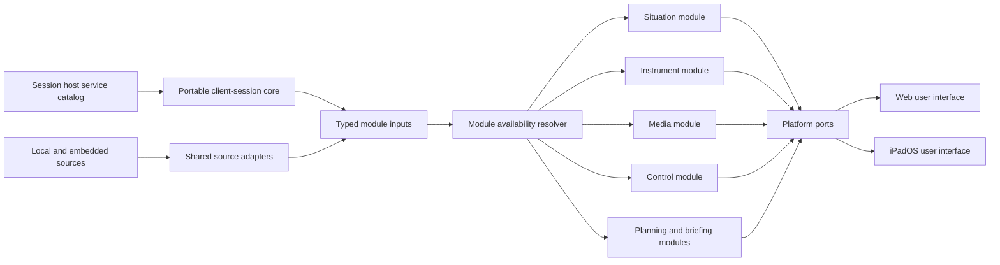

# ADR-0037: Compose operator clients from shared function modules

- Status: Accepted
- Date: 2026-08-10
- Supersedes on acceptance: [ADR-0026](0026-host-capability-profiles.md)
- Tracking issue: [ARCH-06](https://github.com/luofang34/Pilotage/issues/395)

## Context

Pilotage supports web and native operator clients. Each platform can use a
different user interface. Each deployment can also include a different set of
functions.

A coarse client profile cannot describe this composition. A host can supply
telemetry without media. It can supply a situation service without an actuator
scope. A client can implement an instrument display but omit control. A local
source can supply situation data when no host exists.

The project needs one rule for all of these combinations. The rule must keep
data contracts and functional decisions in shared code. It must also permit a
platform to use its native lifecycle, renderer, decoder, and input interfaces.

[ADR-0002](0002-cargo-workspace-portable-sans-io-core.md) defines portable
sans-IO cores. [ADR-0032](0032-ipad-native-client-shared-cores.md) defines the
Apple instrument boundary. [ADR-0036](0036-situational-domain-ownership.md)
defines the situation data owners and `SituationView`. This record defines how
an operator client composes those parts.

## Decision

### Client modules

A **client module** is one operator function with a shared semantic core and
one or more platform ports. A port connects the core to an operating-system or
user-interface service. A port does not own domain policy.

The initial client module families are:

- **Situation:** maps, traffic, weather, aeronautical updates, and other
  read-only situation views.
- **Instruments:** flight instruments, navigation instruments, and display
  alerts.
- **Media:** live video and other time-correlated media.
- **Control:** operator input, authority state, leases, and commands.
- **Flight planning:** plan editing, resolution, filing state, and selection.
- **Briefing:** immutable evidence for one plan and one requested time.

The module list can grow. A new module must define its input contracts, output
contracts, authorization needs, time rules, and failure states.

### Module availability

A source catalog describes the data and operations that a host or a local
composition supplies. It uses semantic descriptors. It does not use one coarse
profile value as the source of truth.

Each descriptor identifies its contract version, source or stream identity,
time rules, and availability state. An operation descriptor also identifies
its authorization requirement.

A client makes a module available only when all three conditions are true:

```text
available module = offered inputs ∩ installed platform port ∩ authorization
```

The offered inputs can come from a session host or from local adapters in the
client process. Authorization includes session admission and each required
operation permission.

The names `full-authority`, `data-gateway`, and `embedded` can describe a
deployment. They are derived descriptions. A client must not select behavior
from one of these names.

An unavailable module reports a typed reason. A client must not show a
placeholder that implies that data or authority exists.

### Shared cores and platform ports

One portable client-session core owns session bootstrap, source-catalog state,
stream classification, reconnect decisions, and explicit deadlines. The core
receives transport events and time as inputs. It emits transport actions and
module input events.

A transport port owns socket and operating-system I/O. It moves bytes and
stream lifecycle events. It does not interpret Pilotage wire messages.

Each client module keeps its functional decisions in shared Rust code. The web
shell uses the shared code through WebAssembly. A native shell links the shared
code through a generated interface or a direct Rust interface.

JavaScript and Swift can own window layout, navigation, accessibility,
credentials, operating-system lifecycle, and platform rendering surfaces. They
must not decode Pilotage messages or derive canonical domain state.

The shared composition has this shape:



### Independent lifecycle and failure

Each module starts and stops independently after catalog changes. Each edge has
a bounded queue and an explicit overflow rule. A failed module must not stop an
unrelated module.

A catalog change can add or remove a module during one session. The client
keeps the reason for each change. A reconnect does not restore control
authority by itself.

The control module needs an advertised actuator operation and explicit
authorization. A read-only client does not request a lease. Telemetry or media
availability does not imply control authority.

### Initial iPadOS integration slice

The initial integration slice adds read-only live instruments to the iPadOS
situation client.

- The iPadOS client connects to the ordinary session host as an observer.
- The portable client-session core handles bootstrap, catalog state, stream
  classification, and reconnect decisions.
- Shared telemetry ingress feeds the shared instrument runtime.
- The Apple instrument bridge supplies scene data to
  `IndicateAppleDisplay`.
- The existing local situation composition continues to operate with no host.
- The slice does not add media or control.

The slice is complete when these conditions are true:

- One captured telemetry input produces the same canonical instrument state
  and scene identity in the web and Apple paths.
- An iPadOS integration test connects to the real session host and renders the
  selected primary flight display (PFD) and horizontal situation indicator
  (HSI) composition.
- A disconnect changes instrument data to `Stale` and then `Failed` under the
  shared clock rules.
- The observer path sends no lease request and no control command.
- The iPadOS client can still show its local situation view when no host is
  present.

## Consequences

- Web and iPadOS can use different layouts and different module sets.
- Functional parity means equal contracts and decisions for an installed
  module. It does not mean equal screens.
- Host capability discovery must describe telemetry, situation, media, and
  operations. Authority scopes alone are not a complete source catalog.
- A local adapter and a remote host feed the same typed module inputs.
- A platform port needs conformance tests for the contract that it implements.
- Media and control can follow the read-only instrument slice without a new
  client architecture.

## Alternatives considered

- **Use one user interface on every platform:** rejected. It prevents each
  platform from using its input, lifecycle, accessibility, and rendering
  strengths.
- **Keep separate web and iPadOS functional backends:** rejected. It duplicates
  session rules, data derivation, and failure policy.
- **Select a fixed client build from a host profile name:** rejected. A profile
  cannot express independent data, media, and authority capabilities.
- **Require a local host process for embedded use:** rejected. Local adapters
  can feed the same typed inputs without a socket or a second process.
- **Add control before read-only instruments:** rejected. The observer slice
  proves session and display composition without adding an authority path.
