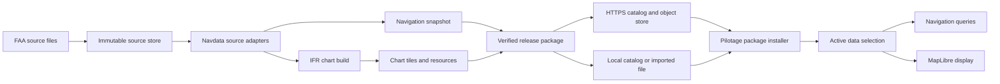

# Aviation data delivery proposal

Status: Proposal. This document does not change the accepted domain contracts.

## Purpose

Publish aviation data independently of the Pilotage application.
Let Pilotage install a complete data selection before it loses network access.
Use the same release package for local development and remote delivery.

The National Airspace System Resources (NASR) product supplies FAA records.
The Coded Instrument Flight Procedures (CIFP) product supplies coded navigation records.
A navigation snapshot is one immutable set of navigation records.
A chart package contains map tiles, styles, symbols, and text resources.
A source set identifies the exact source files used by a build.
A data selection identifies the navigation snapshot and chart packages used together.

## Inspection record

These observations describe the files and remote state inspected on 2026-09-11.
They are evidence for this proposal, not release acceptance results.

| Component | Observed state | Consequence |
| --- | --- | --- |
| Local `ifr-map-lab` | Has NASR/CIFP adapters, chart policy, a GeoPackage producer, network/detail tiles, and release verification. | Reuse this chart production work. |
| GitHub `ifr-map-lab` | `main` is at `68ce5243`. The published August release has three sample assets. | A branch or sample release is not a complete update feed. |
| Local chart data | `web/data/manifest.json` describes a bounded sample. Its source tables have different effective dates. | Do not treat the sample as national coverage or collapse its dates. |
| IFR renderer | Pins `73ee3c88` and declares 28 patches in `tools/maplibre-rs-web/build.json`. | Chart support needs a capability check on each Pilotage renderer. |
| Pilotage globe renderer | Pins `ecb03cdc`. Its host creates a `ReqwestHttpClient` and uses a cache directory. | The globe has no installed aviation-package source in its active input path. |
| Pilotage navigation tiles | Builds deterministic MBTiles from a navigation snapshot. Its documented schema omits procedures. | Keep the tests and identity rules. This is not a complete CIFP delivery format. |
| Pilotage tile reader | `open_file_blocking` reads the whole archive into an in-memory SQLite database. | Use file-backed reads for large installed packages. |
| AeroContext navigation delivery | Has `.acnav` blobs, subscriptions, current/next selection, hashes, and HTTPS/IPFS delivery. | Reuse useful mechanisms behind a new package contract. |
| AeroContext publication | The inspected workflow can replace assets under an existing release name. | Corrected public data needs a new immutable build identity. |
| Navigation snapshot model | Contains points, airways, runways, and airspaces. It has no procedure collection. | Full procedure semantics need explicit model and parser work. |
| Pilotage weather positions | Has a cycle-loading FFI method. The inspected Swift application does not call it. | An installed navigation snapshot must also supply weather-station positions. |

The inspected delivery implementation is in `v99n62/crates/aerocontext-navdata`.
It uses the `.acnav` file format. This is the reusable code identified for the
ARNav-era delivery path. This inspection did not establish an additional
ARNav-specific storage contract.

## Ownership

Keep the ownership rules in [ADR-0036](adr/0036-situational-domain-ownership.md).

| Owner | Responsibility |
| --- | --- |
| Navdata | Source adapters, navigation identity, normalized records, source differences, and navigation queries. |
| IFR Map Lab | Chart eligibility, display geometry, chart layout, styles, symbols, and chart verification. |
| Publisher | Collect source files, run builds, preserve evidence, and publish approved artifact sets. |
| Pilotage | Select packages, install them, manage storage, compose views, and report data status. |
| MapLibre adapter | Read installed tiles and resources. Report unsupported display features. |
| Airmass and AeronauticalUpdates | Manage weather and notices with their own validity rules. |

The publisher is a build and delivery service. It does not become a new domain owner.
Communicate can supply shared transfer mechanisms where more than one consumer needs them.



Share typed source adapters between the navigation and chart builds.
Do not copy parsers into the iPad application.
Keep source observations separate from chart display decisions.
During integration, bind the two existing builds to one exact source set.
Replace duplicate adapters in separate changes.

## Storage formats

Use a format for each access pattern.
Mapbox Vector Tiles (MVT) contain the geometry and properties used to draw tiles.
PMTiles is an indexed archive of tiles.
GeoPackage is a SQLite format for geographic records.

| Data | Proposed form | Storage and use |
| --- | --- | --- |
| Original NASR, CIFP, and supporting files | Original bytes with source metadata and hashes | Publisher archive. Retain for verification and rebuilds. |
| Navigation records | Versioned immutable SQLite database behind a typed Rust query API | iPad and host. Index identifiers, relationships, and geographic queries. |
| Existing navigation consumers | `.acnav` compatibility artifact | Keep until consumers use the complete navigation query contract. |
| Complete chart production records | `national.gpkg` and verification reports | Publisher and development tools. Optional diagnostic download. |
| IFR overview | Network MVT in PMTiles | A national package where measured size permits it. |
| Detailed chart display | Detail MVT in regional PMTiles packages | Download by region or planned route. |
| Display resources | Versioned styles, glyphs, sprites, metrics, and notices | Install with the chart profile that requires them. |
| FAA chart documents | Original PDF/GeoTIFF plus optional tiled display copies | Separate region or airport packages. Preserve edition identity. |
| Terrain, coastlines, and general base maps | Separate tile packages | Independent provider, edition, resolution, and storage budget. |
| Weather, traffic, and notices | Domain stores and live display updates | Independent expiry. Do not bake them into a navigation cycle. |

The SQLite proposal describes a new navigation read model.
`national.gpkg` is not already that model.
Preserve source record identities, units, accuracy, and unresolved references.
Retain procedure leg types, order, transitions, constraints, and termination rules.
A procedure line on a chart is not an executable navigation procedure.
Counting every CIFP record family does not prove that every family is supported.

Keep `.acnav` as a compatibility output during this work.
Do not rename it and imply that its content is complete.
Change its schema only when the required semantics and compatibility tests exist.

Use PMTiles as the target delivery format for MVT.
It supports selective remote reads through HTTP byte ranges.
It is immutable and requires a new file for an update.
These properties fit versioned packages.
See the [PMTiles format guide](https://docs.protomaps.com/pmtiles/).

Implement a file-backed PMTiles source for the Pilotage Rust renderer.
Use the same tile selection logic with a local-file reader and a remote-range reader.
This is required work; it is not a capability of the installed globe build.
Keep MBTiles as a compatibility output for MapLibre Native while needed.
Produce both archives from the same validated MVT stream.
Do not require the tablet to convert a national archive or run an HTTP server.

XYZ directories remain useful for diagnostics and compatible HTTP delivery.
Do not install millions of individual tile files as the main offline format.
Do not turn the full GeoPackage or national GeoJSON into a live display batch.

## Source acquisition and builds

Use the existing IFR Map Lab cycle pipeline as the chart build entry point.
Its `fetch-cycle` program can resolve, probe, and fetch FAA cycle products.
Its `scripts/build_cycle_candidate.py` runs the complete candidate build.
Its `scripts/verify_national_release.mjs` checks the national chart artifacts.
The inspected local workflow already checks active and upcoming cycles each day.
Publish this work through source review before depending on it in a hosted service.

Run scheduled source checks and support an explicit rebuild request.
Fetch into a new work directory for each candidate.
Record the source URL, retrieval time, product dates, byte length, and hash.
Compare source hashes even when the named cycle has not changed.
A source correction within one cycle must produce a separate candidate.

Copy accepted source bytes into the publisher archive.
The ignored local `data/cache/` directory is a working cache, not that archive.
Use the same source-set manifest for the navigation and chart builds.
Adapt their outputs into one consumer release with explicit dependencies.
Keep candidate construction separate from promotion to the stable catalog.

For local use, export a complete release directory or an import archive.
Serve that directory through the local catalog, or select the archive in Pilotage.
The archive must contain its manifest and all required package resources.
The installer uses the same checks for this input and a remote download.
Pilotage consumes these outputs. It does not fetch source repository worktrees.

## Publication and source identity

Use one catalog endpoint to discover releases.
Host immutable artifacts on an HTTPS object store with a content delivery network.
GitHub can retain source, review records, and release links.
Do not make the iPad depend on GitHub branch names or private repository credentials.
The existing public demo remains a separately identified research publication.

A local server exposes the same catalog and artifact contract.
An imported package uses the same verification and installation steps.
A local path is a transport choice; it is not an approval state.
Identify development packages explicitly and keep them out of the stable selection.

Use three independent identities:

| Identity | Meaning |
| --- | --- |
| Source set | Exact authority/product files and their hashes, with package and table dates. |
| Build | Exact source set, parser, schema, chart policy, resources, and build configuration. |
| Release | An immutable published artifact set with its approval and compatibility record. |

A corrected build of one FAA cycle gets a new release identity.
It does not overwrite the earlier files.
A catalog entry can identify which release supersedes another.
Retain published source inputs and release manifests under a documented archive policy.
Deduplicate identical content by hash.

The release manifest needs these groups:

- Identity: release ID, source-set digest, navigation snapshot ID, and predecessor.
- Validity: product authority, edition, `effective_at`, `expires_at`, and source table dates.
- Coverage: regions, record families, zoom limits, occupied cells, and known exclusions.
- Artifacts: relative path, role, byte length, SHA-256, format, and schema version.
- Dependencies: exact data, style, sprite, glyph, and terrain requirements for each profile.
- Compatibility: required renderer capabilities and the tested application build.
- Evidence: source accounting, semantic changes, geometry checks, and display results.
- Publication: channel, catalog revision, signature, and metadata expiry.
- Rights: source attribution and permission to distribute each data and font resource.

Keep archive hashes separate from normalized-record digests.
A changed compression setting can change the archive hash without changing its records.
A matching date cannot prove that two corrected source files have equal content.

Sign the catalog and bind each release manifest by hash.
The application has an explicit set of trusted publisher keys.
Artifact hashes alone do not authenticate a replaced catalog.
Use separate trust configuration for local development packages.
Keep provider credentials in the platform credential store.

A full file hash verifies a complete download.
It does not independently verify an arbitrary byte range from a partial remote read.
If remote reads need that property, add authenticated block hashes.
Do not claim that a partial stream passed whole-file verification.

Publish candidate files first.
Run the complete verifier against those files.
Promote the catalog entry only when required checks pass.
An unavailable next cycle is a reported availability state.
It does not authorize fabrication of an empty next-cycle package.

## Offline installation

Separate installed content from disposable cache content.
Apple permits the system to remove cache files to recover storage.
Use Application Support for explicitly installed packages.
Exclude downloadable packages from backup.
See [Apple file storage guidance](https://developer.apple.com/library/archive/documentation/FileManagement/Conceptual/FileSystemProgrammingGuide/FileSystemOverview/FileSystemOverview.html).

```text
Library/Application Support/Pilotage/Data/
  catalog.sqlite
  objects/<sha256>
  releases/<release-id>/manifest.json
  staging/<download-id>/

Library/Caches/Pilotage/
  remote-ranges/
  decoded-tiles/
```

`catalog.sqlite` records installed objects, references, and active selections.
It does not hold a second authoritative copy of navigation records.
Keep reader connections read-only.
Use one writer for download and installation state.

Install a package with this sequence:

1. Resolve the complete dependency set and its storage requirement.
2. Reserve space without removing the active selection.
3. Download missing immutable files into staging.
4. Resume a partial download only when the remote object identity still matches.
5. Verify lengths, hashes, schemas, dependencies, and declared coverage.
6. Open the navigation database and archive indexes for validation.
7. Move verified files to permanent object paths.
8. Commit the complete installed release in one database transaction.
9. Change the active selection only at a permitted session boundary.

An interrupted install leaves the active selection usable.
An object written before a failed database transaction is an unreferenced object.
Recovery can remove it after it checks all retained references.
Open sessions hold references to their complete selections.
Garbage collection must not remove those objects.

Keep current, next, and one previous compatible release when storage permits.
Keep any additional release pinned by a flight record or replay.
Remove disposable cache entries before installed packages.
If space is insufficient, keep the active package and report the required space.

An offline region is complete only when its required resources are installed.
This includes glyphs, sprites, styles, and requested terrain or chart references.
Separate optional resources from required resources in the profile.
Report the actual geographic and zoom coverage.
A bounds rectangle or a cached view does not prove complete offline coverage.

## Renewal and session consistency

NASR and CIFP have 28-day publication cycles.
FAA enroute chart editions have 56-day coverage periods.
Other products and source tables can have different dates.
Use each product's published validity window.
Do not assign one date to every file.
See the [NASR subscription](https://www.faa.gov/air_traffic/flight_info/aeronav/aero_data/NASR_Subscription/),
[CIFP download information](https://www.faa.gov/air_traffic/flight_info/aeronav/digital_products/cifp/download/),
and [IFR chart editions](https://www.faa.gov/air_traffic/flight_info/aeronav/digital_products/ifr/).

Store effective times as UTC instants when the authority specifies a time.
Do not derive activation from the device's local midnight.
Keep the source package date separate from effective dates inside its tables.

Check for updates when the app opens and when the user requests an update.
Use background downloads to prepare the next release.
Treat background execution as an opportunity, not a guaranteed renewal deadline.
Check installed validity again when a session starts.

A selection binds the navigation snapshot, chart release, display profile,
and applicable reference packages.
Require matching source identities for navigation-derived chart features and overlays.
Do not require a terrain edition or 56-day raster edition to equal a NASR date.
Check their compatibility and applicable time intervals instead.
Document this distinction when refining ADR-0036's composition rule.

Pin the selection for an active flight or replay.
A download must not silently change its source records or chart style.
If data expires during the session, keep the display and show its expired state.
Require explicit revalidation before navigation activation uses a different snapshot.
An expired metadata signature or a failed update must not erase installed data.
Report what can no longer be verified as current.

## Display in Pilotage

Separate chart content from map projection.
Offer Terrain, IFR Low, and IFR High as content choices.
Use globe projection for all content choices.
Keep one renderer and one camera when the content choice changes.
Keep north at the top of a zoomed-out overview.
Do not hide the data cycle inside a renderer setting.

The Data screen shows each installed product and region.
It shows effective dates, coverage, size, download progress, and the selected release.
Use explicit states: Current, Next ready, Expired, Incomplete, and Unavailable.
Show an expired or incomplete active selection on the map.
Do not show an empty region as complete source coverage.

Draw static chart tiles through the renderer source adapter.
Resolve a selected chart feature through its domain identity and record version.
Do not use a shortened tile label as the navigation record.
Let the navigation snapshot also supply airport and weather-station positions.
Compose traffic, weather, and notices through their existing domain adapters.
Independent coordinates do not need a navigation-cycle join.
An update that names a navigation subject does need a checked identity relation.

Report unsupported chart profiles before loading their styles.
Do not silently omit private metadata that implements required chart symbols.
Test the same profile, resources, and renderer on the physical iPad.
Keep chart-data integrity separate from chart display acceptance.
The inspected IFR Map Lab documents leave full chart conformance open.
Its Futura resource hashes do not establish distribution rights.
Record the required permission before publishing those resources in a product package.

## Implementation sequence

1. Define release and selection contracts. Preserve the existing Navdata identity fields.
   Test same-cycle corrections, independent product dates, and incompatible schemas.
2. Adapt both existing producers to an exact source-set contract.
   Retain `.acnav` as a compatibility output and IFR Map Lab as the chart producer.
   Verify a complete candidate without changing the public feed.
3. Add the Pilotage installer and persistent object store.
   Test cancellation, corruption, insufficient space, crash recovery, and retained selections.
4. Add the file-backed tile source to the globe renderer.
   Test cold launch with all network access disabled, including fonts and sprites.
5. Integrate the required IFR renderer features and package resources.
   Verify LOW/HIGH display, globe behavior, dense areas, and region boundaries.
6. Add the Data screen, update preparation, and session selection rules.
   Test cycle changes, expired data, unavailable previews, and replay retention.
7. Complete the navigation model for required CIFP families.
   Test source accounting and procedure semantics independently of chart pixels.
8. Publish the approved immutable packages and catalog.
   Verify remote downloads with the same installer used for local packages.

Each step can be reviewed and reverted independently.
No remote publication, source-repository change, or data migration is performed by this proposal.
