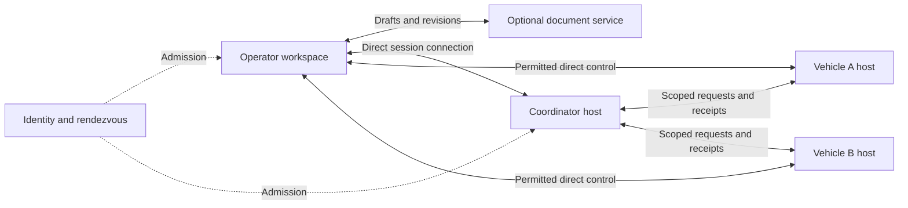

# Coordinated mission planning

Status: Proposed product and architecture design.

The [local planner](mission/planner-implementation.md) implements route search and coordinated timing.
Shared editing, owner acceptance, and live release remain proposed.

## Purpose

A mission can use vehicles from several people and organizations.
Each vehicle can have a different route, operator, start time, and control policy.
Pilotage must show one shared objective and the separate commitments that support it.

This design covers shared planning and live coordination.
It does not grant vehicle control through document access.

## Terms

| Term | Meaning |
|---|---|
| Mission | A shared objective with participants, assignments, and coordination conditions. |
| Assignment | Work assigned to one vehicle or one participant. |
| Participant | A person, organization, or automation principal admitted to the mission. |
| Principal | An authenticated person or software identity that performs an action. |
| Vehicle owner | The authority that permits use of a vehicle. Ownership and operation can differ. |
| Vehicle binding | A reference from a planned vehicle to its current host, session, and vehicle ID. |
| Milestone | An identified result that another assignment can require. |
| Time on target (ToT) | A required UTC arrival time at a specified route occurrence. |
| Revision | An immutable, published version of a mission plan. |
| Run | One execution of a specific revision. |
| Coordinator host | A host that evaluates shared conditions and requests work from member hosts. |
| Control scope | One independently assignable vehicle function, such as motion or camera control. |

## Example

A coastal survey uses two aircraft and one boat.
An individual owns Aircraft A. A survey company owns Aircraft B.
A port organization owns Boat C.

| Assignment | Vehicle | Work | Entry condition | Shared result |
|---|---|---|---|---|
| Survey north | Aircraft A | Follow the north survey route. | Its operator accepts the assignment. | North images available. |
| Survey south | Aircraft B | Follow the south survey route. | Its operator accepts the assignment. | South images available. |
| Inspect site | Boat C | Visit a selected survey site. | The assigned survey result is accepted. | Site inspection complete. |

Each owner approves its assignment and the conditions that affect it.
The mission coordinator can request an assignment change.
The affected owner decides whether to accept that change.
Boat C can receive a site and a completion event without receiving either aircraft's full track.

## Operator workspace

Use one mission workspace with `Plan` and `Live` views.
Keep the map renderer and camera when the operator changes the selected vehicle.
Use the existing native Liquid Glass map controls.
Use standard lists and document surfaces for route text, tables, and editing.

The iPad workspace has four regions:

| Region | Content and behavior |
|---|---|
| Mission header | Mission name, revision, plan state, synchronization state, and participants. |
| Vehicle list | Vehicle name, owner, assigned operator, assignment, readiness, and connection age. |
| Map and timeline | All permitted routes and work areas. One timeline lane per vehicle. Links show assignment dependencies. |
| Selection inspector | The selected assignment, route, timing, conditions, shared data, and acceptance state. |

Select a vehicle to emphasize its route and open its assignment.
Other permitted routes remain visible with reduced emphasis.
Use labels and line patterns as well as color to identify vehicles.
The map does not move unless the operator selects `Show on Map` or a follow action.
Show planned positions and observed positions with different symbols.
Every observed position has a source age and an availability state.

On a narrow screen, show the vehicle list as a sheet.
Show the selected assignment above the map in a compact bar.
The bar shows the mission name and readiness counts when several vehicles are selected.
It shows route endpoints only when one route is selected.
Do not show sample distance or duration values as calculated results.

### Planning flow

1. Create a mission and describe its objective.
2. Add participants or import a participant list.
3. Add available vehicles or unassigned vehicle requirements.
4. Create one or more assignments for each vehicle.
5. Add route references, work areas, timing, and required capabilities.
6. Connect assignments through named milestones and time conditions.
7. Select the information that each participant can receive.
8. Review conflicts and missing information.
9. Publish a revision for owner acceptance.
10. Review the acceptance and readiness of each assignment.

### Time on target

Each assignment can have its own ToT.
A swarm can have a common ToT with a separate route occurrence for each member.
Each condition has an early and late tolerance.
A member can have an offset from the common time.
Use this offset to define an arrival order.

Bind each timing condition to exact assignment and route occurrence IDs.
Do not infer the target from the last waypoint after a route change.
Check the departure window for each member.
Report a conflict when one member's target windows do not intersect.
Report unknown timing when speed, departure, or route data is absent.
An estimated arrival within tolerance does not prove execution readiness.

Publishing a revision does not send a vehicle command.
An invitation does not permit use of the invited participant's vehicles.
Accepting a mission invitation and accepting an assignment are separate actions.

### Live view

Show the accepted revision and observed run state for each vehicle.
Show the current holder of each relevant control scope.
Show readiness, active work, pending milestones, and exceptions in the timeline.
Show `Unknown` when a host report is unavailable.
Do not infer completion from a planned time or an old position.

An operator can propose a change while a run continues.
The proposal appears beside the active revision until the required parties accept it.
The affected host must acknowledge the revision it adopts.
Show mixed revisions explicitly during an incomplete change.
Do not replace an active assignment with a draft edit.

## Plan records

Use stable IDs for records. Do not use display names as keys.
Qualify external identities with their issuer.
Keep the durable vehicle identity separate from the runtime vehicle binding.
Key runtime vehicle state by host instance, session, and vehicle ID.

| Record | Required content |
|---|---|
| MissionPlan | Mission ID, schema version, revision ID, parent revision, content digest, objective, participant references, assignment references, and condition references. |
| ParticipantGrant | Principal reference, issuer, mission role, permitted records, permitted data, and validity. |
| VehicleAssignment | Assignment ID, vehicle reference or requirement, owner, operator, work reference, capabilities, and completion policy. |
| CoordinationCondition | Condition ID, producer, consumer, milestone reference, timeout, and unavailable-input policy. |
| PlanAcceptance | Principal, authority evidence, exact revision digest, accepted assignments, conditions, and expiry. |
| MissionRun | Run ID, plan revision digest, coordinator identity, coordinator epoch, and member run references. |
| MemberStatus | Vehicle binding, assignment, adopted revision, run state, source sequence, observation time, and freshness. |
| MilestoneReceipt | Run, assignment, milestone, producer identity, evidence reference, sequence, and clock identity. |

Keep routes in the flight-planning domain.
An assignment refers to an immutable flight-plan handoff and its navigation-data identity.
It does not copy a second set of route coordinates into a mission executor.
Non-flight assignments use typed work references with their own units and validation rules.
An assignment that needs a future vehicle can specify capabilities before it has a binding.

Validate dependency cycles before publication.
Declare the required participants for each condition.
Define whether an assignment can continue when an optional participant is absent.
Validate overlapping vehicle assignments and exclusive payload use.
Treat calculated route conflicts as review results with stated inputs and limits.

## Permissions and organizational boundaries

| Role | Plan permissions | Vehicle authority |
|---|---|---|
| Mission coordinator | Manage the objective, propose assignments, and request acceptance. | Only the scopes granted by each member host. |
| Vehicle owner | Admit the vehicle and approve its assignments and sharing policy. | Determined by the vehicle's local authority policy. |
| Assignment planner | Edit the permitted assignments and submit changes. | None from this role. |
| Vehicle operator | Review assigned work and report operational decisions. | Only the current leases granted by the member host. |
| Observer | Read the permitted plan and run information. | None. |

One person can have several roles.
Several people can operate different scopes on one vehicle.
An individual can participate without creating an organization.
Organization membership does not automatically permit access to every member's data.

Show the acting principal and organization when an operator submits an acceptance.
Bind that acceptance to the applicable membership or delegation evidence.
An owner decides which external identity issuers it accepts.

Each owner selects shared records and data streams.
Shared data can include only milestones, delayed positions, or a selected payload result.
Keep private route and payload records outside the shared mission document.
The published revision binds permitted assignment references and their digests.
An acceptance identifies the shared revision and the exact private assignment digest it covers.
Recipients must not treat a partial view as the full mission plan.

Enforce access when records are read, changed, exported, or synchronized.
Enforce control authority again at the destination host.
Record acceptance, withdrawal, handover, and refusal with the acting principal.
Show revocation as pending until the affected host acknowledges it or the grant expires.
Do not claim immediate revocation at a disconnected host.

## Components

The document service stores permitted drafts, revisions, and acceptances.
It can run locally or in an organization's deployment.
File exchange can replace it for disconnected planning.
It does not carry control frames, live telemetry, or authority events.
Active runs do not depend on this service remaining available.

The coordinator host evaluates dependencies between assignments.
It requests work through each member host's ordinary session protocol.
It acts as an admitted automation principal at each member host.
Each member host remains authoritative for its scopes and vehicle behavior.
Direct operator takeover fences the coordinator on that scope.
It does not revoke unrelated scopes or other vehicles.

Use one vehicle mission sequencing core for assignment execution.
The coordinator does not duplicate flight-phase transitions or guidance algorithms.
Its separate concern is the dependency graph between member runs.
The client can close without stopping a run that its hosts can continue.

## Revision exchange and offline work

Store a local working copy and the last accepted revision.
Record edits as operations against an identified base revision.
The document service uses conditional revision updates to reject conflicting writes.
Permit automatic merge only for changes to independent records or explicitly commutative fields.
Concurrent route order, assignment, timing, dependency, or permission edits require review.
Show both proposals and their authors. Do not silently choose the last write.

An offline edit remains a draft until it is synchronized and accepted.
Queue document operations separately from vehicle commands.
Do not replay queued live commands after reconnection.
Reject duplicate operation IDs and stale acceptance digests.
Recheck the actor's permission when an offline operation reaches the receiver.

A local mission package contains the permitted plan records and required data references.
Record each navigation, chart, terrain, and procedure edition by ID and digest.
Show missing files and expired editions per assignment.
Recheck package availability and validity at admission.
Do not silently change the data edition inside an accepted revision.

## Release and failure behavior

Use two explicit steps: `Prepare` and `Release`.
During preparation, each member checks its assignment, data, capabilities, and authority.
It returns a receipt for the exact revision and a bounded preparation validity.
A release identifies the run, revision, participants, deadline, and required receipts.
Each member can refuse an expired or changed release.

Several hosts cannot guarantee simultaneous execution across a network partition.
Show each member as prepared, released, acknowledged, running, or unknown.
Show a partial start when only some members acknowledge execution.
The plan must define the response to a partial start and a missing dependency.

Use UTC for planned times and include the required timing tolerance.
Use local monotonic deadlines for runtime expiry.
Do not compare monotonic timestamps from different hosts.
A time-dependent condition requires a clock mapping and a bounded uncertainty.
Stale, duplicated, or out-of-order receipts cannot release a dependent assignment.

Every member has an accepted policy for coordinator loss and link loss.
That policy can permit independent continuation or require a local termination procedure.
Do not select a generic hover, stop, or return action for all vehicle types.
A coordinator restart restores the same run identity from durable evidence.
A replacement coordinator must obtain new member authority before issuing requests.
An epoch number alone does not grant authority.
Each member rejects a request from a superseded lease generation.

## Repository fit

The Apple `MissionPlanModel` contains one mutable route token list.
Its summary contains sample distance and duration values.
The planner therefore needs a mission document model before shared editing is enabled.
Add a selected assignment ID above the route editor.
The editor must change the selected assignment only.

The `pilotage-mission` engine contains navigation and guidance integration.
The common sequencing core in ADR-0041 is a proposal, not a completed extraction.
Implement that boundary before adding coordinated execution to the mission core.
Keep coordination conditions separate from vehicle flight phases.

This proposal follows the accepted scoped-lease model in
[ADR-0006](adr/0006-capability-auth-scoped-leases-fencing.md).
It extends the proposed host model in
[ADR-0028](adr/0028-multi-vehicle-and-swarm-coordinator-hosts.md).
It preserves the proposed service boundary in
[ADR-0027](adr/0027-optional-coordination-server.md).
The optional document service is a separate responsibility from identity and rendezvous.
The execution boundary follows
[ADR-0041](adr/0041-one-mission-sequencing-core.md), subject to its acceptance.

## Delivery and acceptance

| Step | Deliverable | Required checks |
|---|---|---|
| 1 | Local mission document, vehicle list, assignment editor, and timeline. | Two vehicles retain separate routes. Missing calculations show as unavailable. Selecting a vehicle retains the map renderer. |
| 2 | Revision publication, participant grants, owner acceptance, and offline exchange. | Cross-owner edits are refused. Conflicting offline route edits require review. Changed digests invalidate acceptance. |
| 3 | Multiple session attachments and a live mission view. | Repeated vehicle IDs in different sessions remain distinct. Restricted tracks stay private. Stale reports show as stale. |
| 4 | Coordinator host and dependency release. | Lost receipts, clock uncertainty, coordinator loss, duplicate requests, and partial starts produce the declared outcomes. |
| 5 | Coordinated change and operator handover. | Direct takeover fences only its scope. Mixed revisions remain visible. Restarted coordinators cannot reuse expired authority. |

Use the coastal survey example as an end-to-end acceptance case.
Run it with one individual and two organizations.
Disconnect one participant during a plan change and one member during release.
Verify the visible state and the refused actions at each boundary.
